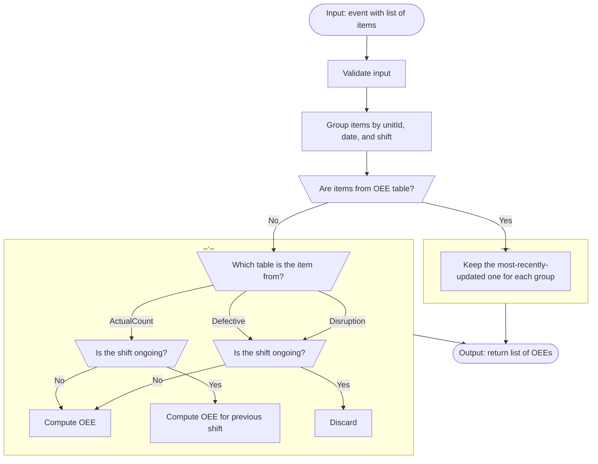

# `calculate-OEE` Lambda Function

## What is _OEE_?

You can see its definition and how it is computed in [VW's Documentation site][oee].

## Current shift model

1. The morning shift has the current setup
   1. There are 2 shift models
      1. Configurations `A1` and `A2` belong to Shift Model `A`
         1. Slot `A1-1` and `A1-2.1` belong to Configuration `A1`
         2. Slot `A2-2.2` belong to Configuration `A2`
         3. Moreover, `A1-2.1` and `A2-2.2` are split slots
      2. Configuration `B1` belongs to Shift Model `B`
         1. Slot `B1-1` belongs to Configuration `B1`
2. The afternoon shift has the legacy setup
   1. There's a single shift model
   2. There's a single configuration
   3. There are 3 timeslots
3. There are 2 Defective logs in the Morning shift
4. Tehre are 2 Disruption logs
   1. `Disruption 1` starts and ends in Slot `A2-2.2`, and lasts 10 minutes
   2. `Disruption 2`, that starts in Slot `B1-1` (in the Morning Shift), and ends in Slot `C1-1` (in the Afternoon Shift), and lasts 3 hours

Code to generate the chart:

```mermaid
%%{init: {'theme':'base'}}%%
gantt
  title       iProcess' Shift model
  dateFormat  HH:mm
  axisFormat  %H:%M
  todayMarker off

  section Defectives
    Defective 1       :d1, 08:00, 2m
    Defective 2       :d2, 12:10, 2m
    Defective 2       :d3, 17:10, 2m

  section Disruption
    Disruption 1      :d1, 09:40, 10m
    Disruption 2      :d2, 13:00, 3h

  section Timeslots
    Slot A1-1         :t1, 05:30, 2h
    Slot A1-2.1       :t2, after t1, 2h
    Slot A2-2.2       :t3, after t2, 1h
    Slot B1-1         :t4, after t3, 3h
    Slot C-1          :t5, after t4, 3h
    Slot C-2          :t6, after t5, 3h
    Slot C-3          :t7, after t6, 2h
    
  section Configuration
    Config A1         :c1, 05:30, 4h
    Config A2         :c2, after c1, 2h
    Config B1         :c3, after c1, 4h
    Config C1         :c4, after c3, 8h

  section ShiftModel
    Shift Model A     :s1, 05:30, 6h
    Shift Model B     :s2, 09:30, 4h
    Shift Model C     :s3, 13:30, 8h

  section Shift
    Morning shift     :s1, 05:30, 8h
    Afternoon shift   :s2, after s1, 8h
```

## Function behaviour

The function _listens_ to _Create_, _Update_, or _Delete_ (_CUD_) operations on the database, namely to 2 kinds:

1. Operations on the `actualCount`, `disruption` or `defective` tables. Whenever an operation is _heard_, 
**and only if there is the required data**, the OEE is re-computed for the Shift that has been modified.
1. Operations on the `OEE` table. This is to ensure that only 1 OEE is saved per shift.

 

> Due to implementation details, an instance of the Function is created as listener for each of the tables in `(1)` - you can imagine 3 hotlines with 3 teleoperators in the end of the line.
> 
> As there might be updates on any of the tables at the same time, we need `(2)` to make sure only 1 updated OEE is kept per shift.

### Manual testing

#### Pre-requisites

* An existing unit
* An existing shift model (or multiple shift models)
* An existing configuration with its timeslots (or multiple configurations)
* Not required but recommended:
  * At least 1 Disruption in the shift
  * At least 1 Defective item in the shift

### Workflow

 

Code to generate the chart:

[oee]: https://devstack.vwgroup.com/confluence/display/DPPPOC/Calculation+of+OEE
