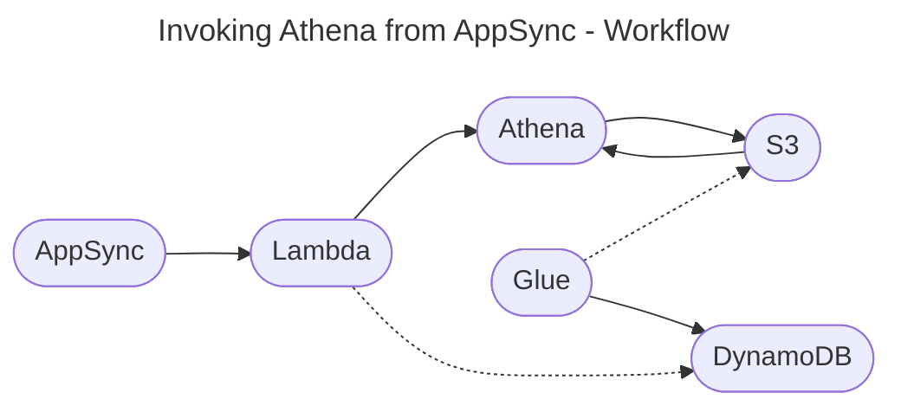

# Invoke Athena from AppSync

```mermaid
---
title: Invoking Athena from AppSync - Workflow
---
flowchart LR
  DynamoDB(["DynamoDB"])
  Athena(["Athena"])
  Glue(["Glue"])
  AppSync(["AppSync"])
  S3(["S3"])
  Lambda(["Lambda"])

  AppSync --> Lambda
  Lambda --> Athena
  Athena --> S3
  S3 --> Athena
  Glue -.-> S3
  Glue --> DynamoDB
  Lambda -.-> DynamoDB
```
