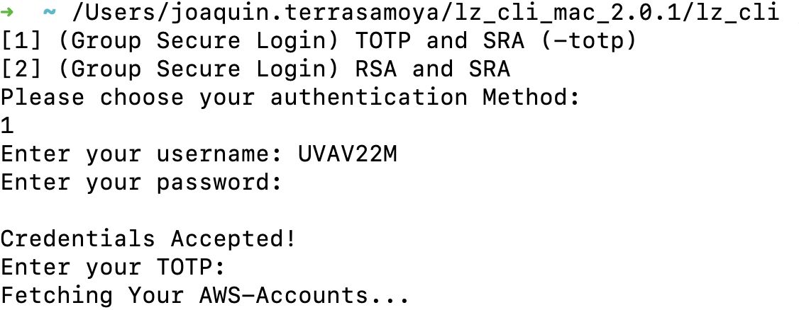
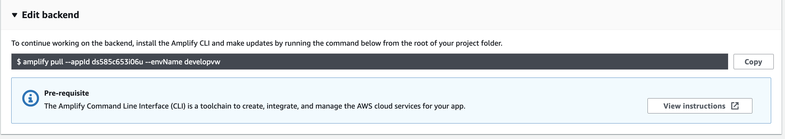

# Working with AWS CLI and Amplify CLI

While working in the DPP Migration to the Volkswagen cloud, we noticed there were some rough edges in the usability of the AWS CLI tools. Here you have some tips & tricks that will make your life easier 💃🏼

## Setup

### 1. Setup your Volkswagen cloud credentials

To do it, you must get the Volkswagen ID generator <a href="https://mwea.sharepoint.com/:u:/s/Volkswagen-DigitaleWerksplattform/EeayM-M1Ln5LlVZjhhqw_bUBJQKo3uIenDTMDh2_je81tw?e=0SiRfK">here</a>.
Unzip it, and move it to a safe folder, such as `$HOME` or _Documents_. Give the script inside execution rights with `chmod +x <fileName>`.

Finally, open it by right-clicking on it while pressing `CTRL` to override security defaults. Choose option 1, type in your AWS credentials, as well as the 2FA code set up in Authenticator. After this, you should see the message `[Process completed]` that indicates the end of the procedure.



### 2. Connect to CodeCommit via HTTPS-GRC

As we use federated access in the Volkswagen cloud, the connection method must be HTTPS-GRC (git-remote-codecommit).

To set it up, you need `git` and Python 3. If you don't have Python 3, then run:

```sh
# run the following line only if you don't have 'brew' already
/bin/bash -c "$(curl -fsSL https://raw.githubusercontent.com/Homebrew/install/HEAD/install.sh)"

brew install pyenv  # an easy-to-use Python version manager
pyenv install 3.8.10  # not the latest version, but a stable one

pyenv global 3.8.10  # set up Python 3.8.10 as the default version anywhere in the system (for 'python3')
python3 -V
```

Then, run `pip3 install git-remote-codecommit` to install the required packages for HTTPS-GRC to work. Finally, you can clone a repository (or manually set up a remote) using HTTPS-GRC:

```sh
git clone codecommit::eu-west-1://iProcess
```

#### Set up your git ID

When git is installed, it creates a default ID with a random email and your account name. This email, however, is not traceable in our system, therefore it is highly recommended to set git up. To do so, edit `~/.gitconfig`:

```conf
[user]
    name = <yourUserName>
    email = <yourEmail>@maibornwolff.de
```

### (Optional) 3. Re-configure AWS CLI and Amplify CLI 

If you already have a configuration set up for AWS CLI and Amplify CLI, and you need to switch to another AWS instance, then make sure to revisit these steps.

#### Set up AWS CLI

After setting up your volkswagen ID credentials, you will have at least 2 profiles in `~/.aws`:

```sh
aws configure list  # shows the current configuration for AWS

cat ~/.aws/config
cat ~/.aws/credentials  # show in console which are the available profiles

# > [default]
# > aws_access_key_id=***
# > aws_secret_access_key=****
# > aws_session_token=*****
# >
# > [profile maibornwolff]
# > aws_access_key_id=***
# > aws_secret_access_key=****

# by setting the 'AWS_PROFILE', you can set which profile to use for the current bash session
export AWS_PROFILE=default

aws configure --profile default  # '--profile default' only needed if you didn't set 'AWS_PROFILE'
```

I recommend to set the profile you want to use as 'default'. For example, I have 2 profiles, 'default' for Volkswagen and 'maibornwolff' for MaibornWolff.

#### Set up Amplify CLI

The Amplify CLI is set up on a per-repository basis. Thus, you'll need to `cd` in a repository folder.

```sh
# get info about what's the current environment and if there's any changes
amplify env list
amplify status -v

# Remove the current setup for Amplify
# These will be re-generated once you're connected to a remote Amplify environment
rm -rf amplify
rm src/aws-exports.js
rm src/aws-exports.ts # if it exists

# Go to the AWS environment you want to use and copy the 'pull' command that it's displayed
amplify pull --appId <yourAppId> --envName <yourEnvName>
```



The last command will open an AWS Amplify Studio tab in your browser, where you can accept the new connection. Now, everything's set up! If you run `amplify status -v`, you should already be prepared to pull and push to your desired environment.

## Cheat sheet

### Update credentials

Regarding the VW AWS setup, we use a federated user; therefore, the credentials must be generated every 8-24h. To do it, run the Volkswagen ID generator again, then:

```sh
export AWS_PROFILE=<yourVwIdProfile>

cd <iProcess repository>
git remote update  # fetches all changes from the AWS repository
```

### Push Repository

Create an empty repository in [CodeCommit][codecommit]. Copy the old repository:

```sh
cp -R oldRep newRepo; cd newRepo
```

### Initialize and push to Amplify

* `amplify configure` sets up Amplify in your device for the first time
* ⚠️ `amplify init` should only be used when you want to create a new environment.
* To push the latest changes in the backend, use `amplify push`; it should take between 4 and 10 minutes.

[codecommit]: https://eu-west-1.console.aws.amazon.com/codesuite/codecommit/start?region=eu-west-1