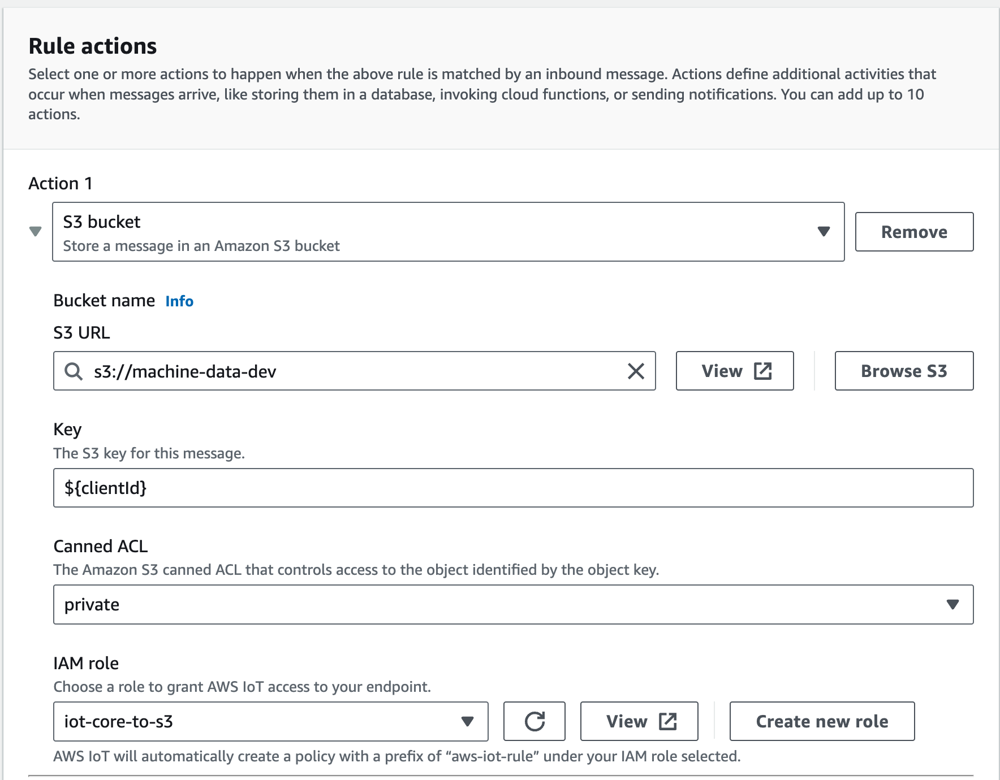
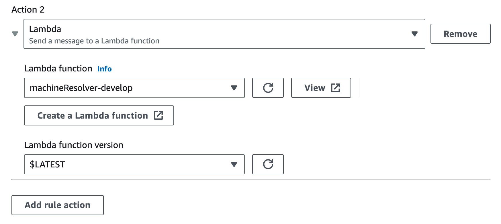

# Working with Machine Data

## Setup

### 1. Setup message routing rules
Using the AWS IoT service: https://eu-west-1.console.aws.amazon.com/iot/home?region=eu-west-1#/rulehub

#### 1.1 Add descriptive rule name
Since we only want to create 1 rule in each environment that subscribes to all topics, please, name it with a descriptive name (e.g subscribe_all_topics).

#### 1.2 Define the SQL statement

```sql
SELECT * FROM "#"
```

#### 1.3 Define different actions

##### 1.3.1 S3 bucket action
First we need to manually create a S3 bucket with a descriptive name with the following format:
```
machine-data-${API_ID}
```
Where `API_ID` is the appsync API ID on each environment (e.g develop: 2bhuxjwdvjh5ddqyyzpfmuusii)


After that, create an action in the current rule that points to this S3 Bucket and set the following KEY:  ```${clientId}``` and IAM Role [iot-core-to-s3](https://us-east-1.console.aws.amazon.com/iamv2/home?region=us-east-1#/roles/details/iot-core-to-s3?section=permissions)



##### 1.3.2 Lambda action
Point to the existing machineResolver lambda



